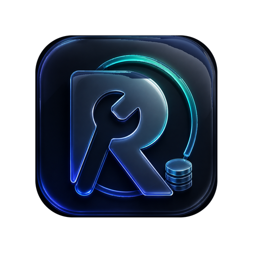
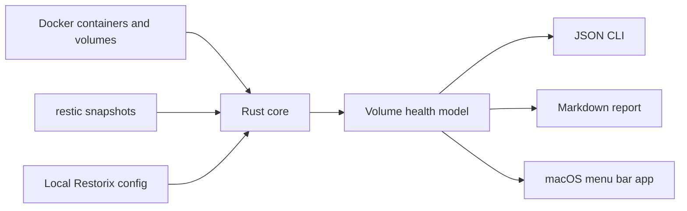

<p align="center">
  
</p>

<h1 align="center">Restorix</h1>

<p align="center">
  <strong>Backup confidence for self-hosted Docker volumes on macOS.</strong>
</p>

<p align="center">
  Restorix compares real Docker volume mountpoints with real restic snapshots, then tells you which data is protected, stale, unknown, or exposed.
</p>

<p align="center">
  <a href="LICENSE"></a>
  
  
  
  
</p>

<p align="center">
  <a href="README.md">English</a> ·
  <a href="README.zh-CN.md">简体中文</a>
</p>

<p align="center">
  <a href="#why-restorix">Why</a> ·
  <a href="#how-it-works">How it works</a> ·
  <a href="#quick-start">Quick start</a> ·
  <a href="#macos-app">macOS app</a> ·
  <a href="#release-verification">Release verification</a>
</p>

## Why Restorix

Running backups is not the same as knowing your production data is restorable. Docker volumes drift, snapshot paths change, restic repositories move, and the failure usually stays invisible until restore day.

Restorix is a focused trust layer for that gap. It does not try to become another backup scheduler. It inspects the backup state you already have and turns it into an operator-grade answer:

> Are my Docker volumes backed up recently enough that I could restore them?

## What It Replaces

| Workflow | What usually happens | What Restorix gives you |
| --- | --- | --- |
| Manual Docker and restic checks | Shell history, fragile path matching, no durable report | One scan that joins containers, volumes, repositories, snapshots, and restore hints |
| Generic backup tools | Great at copying data, weak at proving app-specific Docker volume coverage | Volume-by-volume confidence against the actual Docker mountpoints on this Mac |
| README runbooks | Human-readable, but quickly stale | Markdown reports generated from the latest machine state |
| "It probably backed up" | Hope | `Protected`, `Unprotected`, `Stale`, `Unknown`, and `Error` statuses with reasons |

## Product Shape

Restorix is deliberately narrow:

- It scans Docker containers and Docker volumes.
- It reads restic repositories and snapshots.
- It matches snapshot paths against Docker volume mountpoints.
- It produces a health model that is usable by both CLI automation and the macOS app.
- It exports Markdown reports for audit trails, incident notes, or handoff.
- It surfaces safe restore commands when it can infer them.

Restorix does not currently perform backups, restore data, schedule jobs, or replace restic. That boundary is intentional: the product is strongest as an independent verification layer.

## How It Works



The SwiftUI app does not reimplement Docker or restic parsing. It launches the bundled `restorix` CLI through `Process`, decodes stable JSON models, and presents the same health model the CLI uses.

## Health Model

| Status | Meaning | Operator action |
| --- | --- | --- |
| `Protected` | A matching restic snapshot covers the Docker volume recently enough. | Monitor and keep the repository enabled. |
| `Unprotected` | No usable snapshot was matched for the volume. | Add or repair the restic repository path, then rescan. |
| `Stale` | A snapshot exists, but it is older than the configured threshold. | Run the backup job and verify the next scan. |
| `Unknown` | Docker or restic data was incomplete or confidence was too low. | Review paths, repository access, and matching assumptions. |
| `Error` | The scanner hit a hard failure. | Fix the reported dependency, permission, or command issue. |

## Quick Start

Prerequisites:

- macOS
- Docker or OrbStack running
- `restic` installed
- Rust toolchain for local development

Build and test the Rust workspace:

```bash
cargo build
cargo test
```

Check local dependencies:

```bash
cargo run -p restorix-cli -- docker check --json
```

Add a restic repository without storing the password in Restorix config:

```bash
export RESTIC_PASSWORD="replace-with-your-local-secret"

cargo run -p restorix-cli -- repo add \
  --tool restic \
  --name "Local Restic" \
  --location "/path/to/restic/repo" \
  --password-env-key RESTIC_PASSWORD
```

Scan Docker volume coverage:

```bash
cargo run -p restorix-cli -- scan --json
```

Generate an audit-ready Markdown report:

```bash
cargo run -p restorix-cli -- report markdown --language en
cargo run -p restorix-cli -- report markdown --language zh-Hans
```

## CLI Surface

| Command | Purpose |
| --- | --- |
| `restorix docker check --json` | Verify Docker availability signals. |
| `restorix docker containers --json` | Inspect Docker containers. |
| `restorix docker volumes --json` | Inspect Docker volumes. |
| `restorix repo add ...` | Register a restic repository. |
| `restorix repo list --json` | List configured repositories. |
| `restorix repo test <repo_id> --json` | Confirm repository access and snapshot visibility. |
| `restorix repo enable <repo_id>` | Include a repository in scans. |
| `restorix repo disable <repo_id>` | Temporarily remove a repository from scan results. |
| `restorix scan --json` | Produce the full health model. |
| `restorix report markdown --language en` | Export a Markdown report. |
| `restorix config get --json` | Read local settings. |
| `restorix config set <key> <value>` | Update local settings. |

## macOS App

The app is a SwiftUI + AppKit menu bar utility for daily visibility:

- Dashboard summary for protected and at-risk volumes.
- Volume detail views with reasons, confidence, and restore commands.
- Repository management, enable/disable controls, and repository testing.
- Markdown report export.
- English and Simplified Chinese UI.
- Local notifications.
- Optional dock icon.
- Open at login through `SMAppService.mainApp`.
- Multiple app icon choices.

Run the app verification helper:

```bash
DEVELOPER_DIR=/Applications/Xcode.app/Contents/Developer \
  bash script/build_and_run.sh --verify
```

## Release Verification

Restorix has a single local shipping path for the packaged app:

```bash
DEVELOPER_DIR=/Applications/Xcode.app/Contents/Developer \
  bash script/verify_release_package.sh
```

That wrapper packages `Restorix.app`, stages the bundled CLI, and runs the packaged smoke flow against `dist/Restorix.app`.

Release outputs are generated under `dist/`:

```text
dist/Restorix.app
dist/Restorix-macos-standalone.zip
dist/Restorix-macos-standalone.dmg
```

The GitHub release workflow reuses the same verification script instead of maintaining a parallel release path.

## Configuration

Default configuration path:

```text
~/Library/Application Support/Restorix/config.json
```

For tests and isolated experiments, set:

```bash
export RESTORIX_CONFIG="/tmp/restorix-config.json"
```

Repository passwords are referenced by environment variable name, for example `RESTIC_PASSWORD`, instead of being stored directly in the Restorix config file.

## Repository Layout

```text
Restorix/
  App/                 macOS app entry points, menu bar, launch-at-login verifier
  Components/          SwiftUI reusable UI pieces
  Models/              Swift models and localization
  Services/            CLI bridge, report export, notifications, pasteboard
  ViewModels/          App state and orchestration
  Views/               Dashboard, volumes, repositories, reports, settings
crates/
  restorix-core/       Docker/restic parsing, scanning, matching, reporting, config
  restorix-cli/        Clap CLI over the core model
docs/                  Product notes, architecture, MVP roadmap
script/                Build, run, package, and smoke verification scripts
```

## Development Gates

Use this ladder before treating a branch as shippable:

```bash
cargo test

DEVELOPER_DIR=/Applications/Xcode.app/Contents/Developer \
  xcodebuild -list -project Restorix.xcodeproj

DEVELOPER_DIR=/Applications/Xcode.app/Contents/Developer \
  bash script/verify_release_package.sh
```

## License

Restorix is released under the [MIT License](LICENSE).
