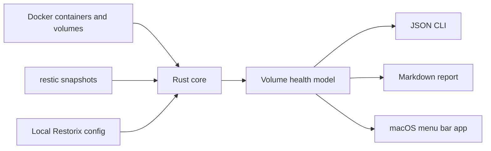

<p align="center">
  
</p>

<h1 align="center">Restorix</h1>

<p align="center">
  <strong>面向 macOS 自托管 Docker 卷的备份可信度检查器。</strong>
</p>

<p align="center">
  Restorix 会把真实 Docker 卷挂载点与真实 restic 快照进行比对，然后告诉你哪些数据已保护、已过期、无法判断，或完全暴露在风险中。
</p>

<p align="center">
  <a href="LICENSE"></a>
  
  
  
  
</p>

<p align="center">
  <a href="README.md">English</a> ·
  <a href="README.zh-CN.md">简体中文</a>
</p>

<p align="center">
  <a href="#为什么需要-restorix">为什么需要</a> ·
  <a href="#工作原理">工作原理</a> ·
  <a href="#快速开始">快速开始</a> ·
  <a href="#macos-应用">macOS 应用</a> ·
  <a href="#发布验证">发布验证</a>
</p>

## 为什么需要 Restorix

备份“执行过”，不等于生产数据“真的可恢复”。Docker 卷会漂移，快照路径会变化，restic 仓库可能迁移，而这些问题往往直到真正恢复的那一天才暴露。

Restorix 是为这个盲区设计的一层可信度验证工具。它不试图变成另一个备份调度器，而是检查你已经拥有的备份状态，并给出一个运维人员真正关心的答案：

> 我的 Docker 卷最近是否已经备份到足以恢复？

## 它替代了什么

| 过去的做法 | 常见问题 | Restorix 提供什么 |
| --- | --- | --- |
| 手动检查 Docker 和 restic | 靠 shell 历史、路径匹配脆弱、没有稳定报告 | 一次扫描串起容器、卷、仓库、快照和恢复提示 |
| 通用备份工具 | 擅长复制数据，但不擅长证明某个 Docker 卷真的被覆盖 | 针对当前 Mac 上真实 Docker 挂载点的逐卷可信度判断 |
| README 运维手册 | 可读，但很快过期 | 从最新机器状态生成 Markdown 审计报告 |
| “应该已经备份了” | 靠感觉 | 带原因的 `Protected`、`Unprotected`、`Stale`、`Unknown`、`Error` 状态 |

## 产品边界

Restorix 的定位非常克制：

- 扫描 Docker 容器和 Docker 卷。
- 读取 restic 仓库和快照。
- 将快照路径与 Docker 卷挂载点进行匹配。
- 产出 CLI 自动化和 macOS 应用都能复用的健康模型。
- 导出适合审计、事故记录和交接的 Markdown 报告。
- 在可以可靠推断时给出安全的恢复命令。

Restorix 目前不执行备份、不恢复数据、不调度任务，也不替代 restic。这个边界是故意保留的：它最强的价值，就是作为独立的备份验证层。

## 工作原理



SwiftUI 应用不会重新实现 Docker 或 restic 解析逻辑。它通过 `Process` 启动随 app 打包的 `restorix` CLI，解码稳定的 JSON 模型，并展示与 CLI 完全一致的健康状态。

## 健康状态模型

| 状态 | 含义 | 运维动作 |
| --- | --- | --- |
| `Protected` | 找到了足够新的 restic 快照覆盖该 Docker 卷。 | 持续监控，并保持仓库启用。 |
| `Unprotected` | 没有为该卷匹配到可用快照。 | 添加或修复 restic 仓库路径，然后重新扫描。 |
| `Stale` | 存在快照，但已经超过配置的过期阈值。 | 运行备份任务，并用下一次扫描确认。 |
| `Unknown` | Docker 或 restic 数据不完整，或匹配置信度过低。 | 检查路径、仓库访问权限和匹配假设。 |
| `Error` | 扫描过程遇到硬错误。 | 根据错误信息修复依赖、权限或命令问题。 |

## 快速开始

前置条件：

- macOS
- Docker 或 OrbStack 正在运行
- 已安装 `restic`
- 本地开发需要 Rust toolchain

构建并测试 Rust workspace：

```bash
cargo build
cargo test
```

检查本地 Docker 可用性：

```bash
cargo run -p restorix-cli -- docker check --json
```

添加 restic 仓库，同时不把密码写进 Restorix 配置：

```bash
export RESTIC_PASSWORD="replace-with-your-local-secret"

cargo run -p restorix-cli -- repo add \
  --tool restic \
  --name "Local Restic" \
  --location "/path/to/restic/repo" \
  --password-env-key RESTIC_PASSWORD
```

扫描 Docker 卷备份覆盖情况：

```bash
cargo run -p restorix-cli -- scan --json
```

生成适合审计的 Markdown 报告：

```bash
cargo run -p restorix-cli -- report markdown --language en
cargo run -p restorix-cli -- report markdown --language zh-Hans
```

## CLI 能力面

| 命令 | 用途 |
| --- | --- |
| `restorix docker check --json` | 检查 Docker 可用性信号。 |
| `restorix docker containers --json` | 查看 Docker 容器。 |
| `restorix docker volumes --json` | 查看 Docker 卷。 |
| `restorix repo add ...` | 注册 restic 仓库。 |
| `restorix repo list --json` | 列出已配置仓库。 |
| `restorix repo test <repo_id> --json` | 确认仓库可访问并能看到快照。 |
| `restorix repo enable <repo_id>` | 将仓库纳入扫描。 |
| `restorix repo disable <repo_id>` | 暂时从扫描结果中排除仓库。 |
| `restorix scan --json` | 生成完整健康模型。 |
| `restorix report markdown --language en` | 导出 Markdown 报告。 |
| `restorix config get --json` | 读取本地设置。 |
| `restorix config set <key> <value>` | 更新本地设置。 |

## macOS 应用

macOS 应用是一个 SwiftUI + AppKit 菜单栏工具，适合日常可视化检查：

- 展示已保护和有风险卷的 Dashboard 摘要。
- 卷详情页展示原因、匹配置信度和恢复命令。
- 管理仓库、启用/停用仓库、测试仓库可用性。
- 导出 Markdown 报告。
- 支持英文和简体中文界面。
- 本地通知。
- 可选 Dock 图标。
- 通过 `SMAppService.mainApp` 支持开机登录启动。
- 多套 App Icon 可选。

运行应用验证辅助脚本：

```bash
DEVELOPER_DIR=/Applications/Xcode.app/Contents/Developer \
  bash script/build_and_run.sh --verify
```

## 发布验证

Restorix 为打包后的 app 保留了一条单一、本地可复现的发布路径：

```bash
DEVELOPER_DIR=/Applications/Xcode.app/Contents/Developer \
  bash script/verify_release_package.sh
```

这个 wrapper 会打包 `Restorix.app`，完成 bundled CLI staging，并针对 `dist/Restorix.app` 运行 packaged smoke flow。

发布产物位于 `dist/`：

```text
dist/Restorix.app
dist/Restorix-macos-standalone.zip
dist/Restorix-macos-standalone.dmg
```

GitHub release workflow 复用同一个验证脚本，不维护第二套并行发布路径。

## 配置

默认配置路径：

```text
~/Library/Application Support/Restorix/config.json
```

测试或隔离实验时可以设置：

```bash
export RESTORIX_CONFIG="/tmp/restorix-config.json"
```

仓库密码只通过环境变量名引用，例如 `RESTIC_PASSWORD`，不会直接写入 Restorix 配置文件。

## 仓库结构

```text
Restorix/
  App/                 macOS app entry points, menu bar, launch-at-login verifier
  Components/          SwiftUI reusable UI pieces
  Models/              Swift models and localization
  Services/            CLI bridge, report export, notifications, pasteboard
  ViewModels/          App state and orchestration
  Views/               Dashboard, volumes, repositories, reports, settings
crates/
  restorix-core/       Docker/restic parsing, scanning, matching, reporting, config
  restorix-cli/        Clap CLI over the core model
docs/                  Product notes, architecture, MVP roadmap
script/                Build, run, package, and smoke verification scripts
```

## 开发验证链路

在把一个分支视为可发布之前，建议跑完整验证链路：

```bash
cargo test

DEVELOPER_DIR=/Applications/Xcode.app/Contents/Developer \
  xcodebuild -list -project Restorix.xcodeproj

DEVELOPER_DIR=/Applications/Xcode.app/Contents/Developer \
  bash script/verify_release_package.sh
```

## 许可证

Restorix 基于 [MIT License](LICENSE) 发布。
